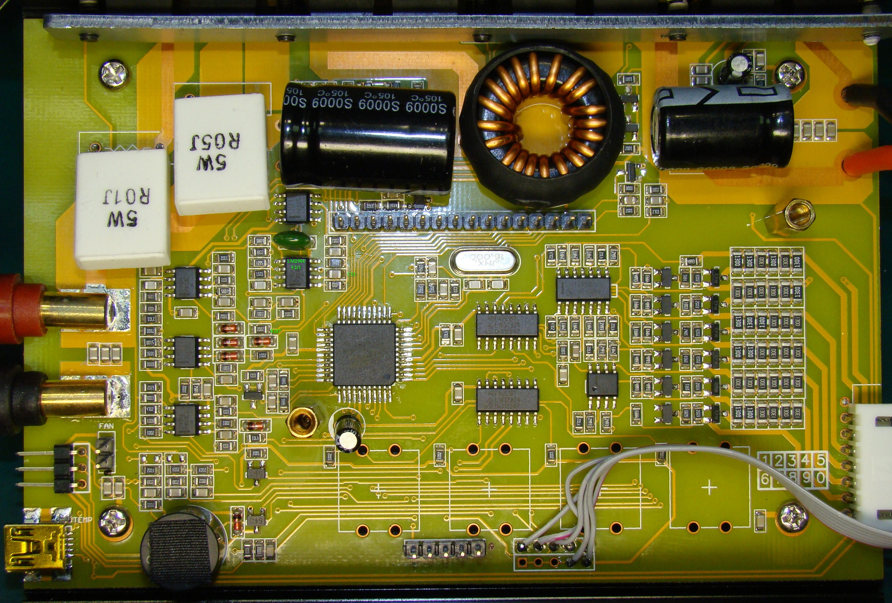

Welcome to cheali-charger!

Fork of Pawel's firmware (Branch:powerSupply at 01.11.2015) https://github.com/stawel/cheali-charger/tree/powerSupply

___

proof of concept - not for every day usage

     THIS FIRMWARE IS FOR HW-MODED CHARGERS ONLY!
	----------------------------------------------

For 150W+ chargers with hardware voltage feedback

*Calibrate charge current BEFORE modification!*

----

How to modify

Disconnect R127 from "AA" point and "ground" it
Connect 240k resistor between "BATT+" terminal and pin2 of LM2904 #5 2/1

240k connected in series with C11 speeds up transient response (step can be skipped)

fork discussion - https://groups.google.com/forum/#!topic/cheali-charger/EuhUAoyecso

___

last changes

17.04.2016
...

---
---
---

Any feedback is very welcome!  
http://groups.google.com/group/cheali-charger

